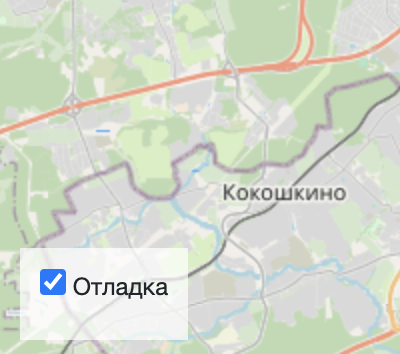

# Where to Go — интерактивная карта

**Where to go** — это сайт, на котором отображаются интересные места на карте. Вы можете кликнуть по точке на карте и посмотреть описание, фотографии и дополнительную информацию о месте.

Проект создан на Django и позволяет легко управлять контентом через встроенную админку. Подходит для использования как презентационный сайт, туристический гид или просто красивый pet-проект.

<p align="center">
  
</p>

## Возможности

- Интерактивная карта с точками локаций.
- Кликабельные точки с подгрузкой описания и фотографий.
- Адаптивная верстка: сайт работает на телефонах и десктопах.
- Удобная админка для добавления/редактирования локаций.
- Drag-n-drop сортировка фотографий внутри локации.
- Поддержка многострочных описаний и форматирования через WYSIWYG-редактор.

## Как работает

1. На главной странице отображается карта.
2. Данные о локациях встроены в HTML в формате GeoJSON.
3. При клике на точку отправляется запрос, и загружаются подробности (описание, фото).
4. Всё наполнение — через [Django admin](https://docs.djangoproject.com/en/5.2/ref/contrib/admin/).

## Установка и запуск

**1. Клонируйте репозиторий**

```bash
git clone https://github.com/1ns0mn1a7/Afisha-Django
cd where-to-go
```

**2. Установите виртуальное окружение и зависимости**

```bash
python -m venv venv
source venv/bin/activate  # на Windows: venv\Scripts\activate
pip install -r requirements.txt
```

**3. Создайте базу данных и выполните миграции**

```bash
python manage.py migrate
```

**4. Создайте суперпользователя для доступа в админку**

```bash
python manage.py createsuperuser
```

**5. Запустите сайт**

```bash
python manage.py runserver
```
Откройте в браузере:
- Главная страница: http://127.0.0.1:8000/
- Админка: http://127.0.0.1:8000/admin/

### Переменные окружения
Создайте файл `.env`:
```env
DEBUG=True
SECRET_KEY=your-secret-key
ALLOWED_HOSTS=127.0.0.1,localhost
```
### Зависимости
- Python 3.10+
- Django 5.2
- Pillow (обработка изображений)
- `adminsortable2` — сортировка фотографий
- `django-tinymce` — WYSIWYG редактор
- `requests` - для парсинга данных из JSON (Django команда)

### Демо
Чтобы добавить тестовые локации:
1. Зайдите в админку.
2. В разделе "Места" нажмите «Добавить».
3. Укажите название, координаты, описание.
4. Прикрепите несколько фотографий (их можно сортировать по порядку)
5. Сохраните — локация появится на карте.

## Настройки

Внизу справа на странице можно включить отладочный режим логгирования.

<p align="left">
  
</p>

Настройки сохраняются в Local Storage браузера и не пропадают после обновления страницы. Чтобы сбросить настройки, удалите ключи из Local Storage с помощью Chrome Dev Tools —&gt; Вкладка Application —&gt; Local Storage.

Если что-то работает не так, как ожидалось, то начните с включения отладочного режима логгирования.

## Источники данных
Фронтенд получает данные из двух источников.

Первый источник — это JSON, запечённый внутрь HTML. Он содержит полный список объектов на карте. И он прячется внутри тега `script`:

```javascript
<script id="places-geojson" type="application/json">
  {
    "type": "FeatureCollection",
    "features": [
      {
        "type": "Feature",
        "geometry": {
          "type": "Point",
          "coordinates": [37.62, 55.793676]
        },
        "properties": {
          // Специфичные для этого сайта данные
          "title": "Легенды Москвы",
          "placeId": "moscow_legends",
          "detailsUrl": "./places/moscow_legends.json"
        }
      },
      // ...
    ]
  }
</script>
```

При загрузке страницы JS код ищет тег с id `places-geojson`, считывает содержимое и помещает все объекты на карту.

Данные записаны в [формате GeoJSON](https://ru.wikipedia.org/wiki/GeoJSON). Все поля здесь стандартные, кроме `properties`. Внутри `properties` лежат специфичные для проекта данные:

* `title` — название локации
* `placeId` — уникальный идентификатор локации, строка или число
* `detailsUrl` — адрес для скачивания доп. сведений о локации в JSON формате

Значение поля `placeId` может быть либо строкой, либо числом. Само значение не играет большой роли, важно лишь чтобы оно было уникальным. Фронтенд использует `placeId` чтобы избавиться от дубликатов — если у двух локаций одинаковый `placeId`, то значит это одно и то же место.

Второй источник данных — это те самые адреса в поле `detailsUrl` c подробными сведениями о локации. Каждый раз, когда пользователь выбирает локацию на карте, JS код отправляет запрос на сервер и получает картинки, текст и прочую информацию об объекте. Формат ответа сервера такой:

```javascript
{
    "title": "Экскурсионный проект «Крыши24.рф»",
    "imgs": [
        "https://kudago.com/media/images/place/d0/f6/d0f665a80d1d8d110826ba797569df02.jpg",
        "https://kudago.com/media/images/place/66/23/6623e6c8e93727c9b0bb198972d9e9fa.jpg",
        "https://kudago.com/media/images/place/64/82/64827b20010de8430bfc4fb14e786c19.jpg",
    ],
    "description_short": "Хотите увидеть Москву с высоты птичьего полёта?",
    "description_long": "<p>Проект «Крыши24.рф» проводит экскурсии ...</p>",
    "coordinates": {
        "lat": 55.753676,
        "lng": 37.64
    }
}
```

## Загрузка данных с помощью команды `load_place`

Для удобного наполнения сайта данными предусмотрена кастомная Django-команда:

```bash
python manage.py load_place http://адрес/файла.json
```

Команда загружает информацию о локации (название, описание, координаты и изображения) из JSON-файла, размещённого по указанному URL.

### Пример использования
```bash
python manage.py load_place https://example.com/data/my_place.json
```

### Что делает команда под капотом:
1. **Получает JSON по ссылке**
Выполняется HTTP-запрос по переданному URL. Есть встроенная обработка временных ошибок соединения (до 3 попыток).
2. **Проверяет наличие места в базе**
Если место с таким `title` уже существует, загрузка будет пропущена, чтобы не создавать дубликаты.
3. **Создаёт объект Place**
Если такого места ещё нет, создаётся объект `Place` с названием, кратким и полным описанием, координатами.
4. **Сохраняет изображения**
Все картинки из массива `imgs` скачиваются и сохраняются как связанные объекты `PlaceImage`, с указанием позиции (для сортировки).

### Пример JSON, который принимает команда

```json
{
  "title": "Антикафе Bizone",
  "imgs": [
    "https://example.com/images/bizone1.jpg",
    "https://example.com/images/bizone2.jpg"
  ],
  "description_short": "Антикафе с уютной атмосферой и настолками.",
  "description_long": "<p>Bizone — это место для встреч, игр и коворкинга ...</p>",
  "coordinates": {
    "lat": 55.7615,
    "lng": 37.621
  }
}
```
**Файл должен быть доступен по прямой ссылке** (GitHub blob-ссылки не подойдут — нужно использовать raw-ссылку, например с raw.githubusercontent.com).

## Используемые библиотеки

* [Leaflet](https://leafletjs.com/) — отрисовка карты
* [loglevel](https://www.npmjs.com/package/loglevel) для логгирования
* [Bootstrap](https://getbootstrap.com/) — CSS библиотека
* [Vue.js](https://ru.vuejs.org/) — реактивные шаблоны на фронтенде

## Цели проекта

Код написан в учебных целях — это урок в курсе по Python и веб-разработке на сайте [Devman](https://dvmn.org).

Тестовые данные взяты с сайта [KudaGo](https://kudago.com).
